# 🚀 GenAI Assistant - Deployment Guide

This guide provides comprehensive information for deploying the GenAI Assistant in production environments, including setup, configuration, monitoring, and maintenance.

## 📋 Table of Contents
- [Production Deployment](#production-deployment)
- [Service Management](#service-management)
- [Server Status Monitoring](#server-status-monitoring)
- [Configuration](#configuration)
- [Troubleshooting](#troubleshooting)
- [Maintenance](#maintenance)

---

## 🚀 Production Deployment

### Automated Production Setup (Recommended)

The easiest way to deploy GenAI Assistant in production is using the automated setup script that handles everything:

#### Quick Setup

```bash
# 1. Make script executable
chmod +x setup_production.sh

# 2. Run production setup (handles everything automatically)
sudo ./setup_production.sh
```

This script will automatically:
- ✅ Check prerequisites (Python, nginx)
- ✅ Setup virtual environment and install dependencies
- ✅ Create .env file from template (if missing)
- ✅ Setup systemd service
- ✅ Configure nginx reverse proxy
- ✅ Setup SSL certificates (optional)
- ✅ Configure firewall
- ✅ Start and enable services
- ✅ Verify deployment

#### Manual Setup (Alternative)

If you prefer manual setup or need more control:

```bash
# 1. Make scripts executable
chmod +x start_production.sh
chmod +x start_development.sh
chmod +x restart_server.sh
chmod +x service_management.sh

# 2. Setup virtual environment
python3 -m venv venv
source venv/bin/activate
pip install -r requirements.txt

# 3. Setup .env file
cp .env_example .env
# Edit .env with your configuration

# 4. Start server manually
./start_production.sh
```

#### Service Management

Use the comprehensive management script:

```bash
# Start service
sudo ./service_management.sh start

# Stop service
sudo ./service_management.sh stop

# Restart service
sudo ./service_management.sh restart

# Check status
sudo ./service_management.sh status

# View logs (follow mode)
sudo ./service_management.sh logs

# View recent logs
sudo ./service_management.sh logs-n

# Test API
sudo ./service_management.sh test

# Update and restart
sudo ./service_management.sh update
```

### Deployment Architecture

```mermaid
graph TB
    subgraph "Production Environment"
        NGINX[🌐 Nginx Reverse Proxy]
        FASTAPI_SVC[⚡ FastAPI Service]
        SYSTEMD[🔧 Systemd Service]
    end
    
    subgraph "Development Environment"
        DEV_SERVER[🛠️ Development Server]
        VENV[🐍 Python Virtual Environment]
    end
    
    subgraph "GPU Infrastructure"
        GPU1[🎮 GPU 1 - Ollama LLM]
        GPU2[🎮 GPU 2 - Transcription]
        GPU3[🎮 GPU 3 - Image Generation]
    end
    
    subgraph "External Services"
        OPENAI_API[🧠 OpenAI API]
        OLLAMA_SERVER[🦙 Ollama Server]
    end
    
    NGINX --> FASTAPI_SVC
    FASTAPI_SVC --> SYSTEMD
    
    DEV_SERVER --> VENV
    
    FASTAPI_SVC --> GPU1
    FASTAPI_SVC --> GPU2
    FASTAPI_SVC --> GPU3
    
    FASTAPI_SVC --> OPENAI_API
    FASTAPI_SVC --> OLLAMA_SERVER
```



### Production Environment Setup

#### 1. System Requirements
- **OS**: Linux (Ubuntu/Debian recommended)
- **Python**: 3.8+
- **Memory**: 32GB+ RAM recommended
- **Storage**: SSD recommended for model storage
- **GPU**: NVIDIA GPUs (multi-GPU setup)
- **Network**: HTTP/HTTPS with CORS support

#### 2. Automated Installation (Recommended)
```bash
# Run the automated setup script
sudo ./setup_production.sh
```

This will automatically:
- Setup systemd service
- Configure nginx reverse proxy
- Setup SSL (optional)
- Configure firewall
- Start and enable services

#### 3. Manual Service Installation (Alternative)
```bash
# If you need to setup service manually, you can use systemctl directly
# But it's recommended to use setup_production.sh instead

# Enable service to start on boot
sudo systemctl enable genai-assistant

# Start service
sudo systemctl start genai-assistant
```

#### 4. Nginx Configuration
```nginx
server {
    listen 80;
    server_name your-domain.com;
    
    location / {
        proxy_pass http://localhost:${WEB_PORT:-5000};
        proxy_set_header Host $host;
        proxy_set_header X-Real-IP $remote_addr;
        proxy_set_header X-Forwarded-For $proxy_add_x_forwarded_for;
        proxy_set_header X-Forwarded-Proto $scheme;
    }
}
```

---

## 🔧 Service Management

### Service Management Script

The `service_management.sh` script provides comprehensive service management:

#### Available Commands
```bash
# Basic service control
sudo ./service_management.sh start      # Start the service
sudo ./service_management.sh stop       # Stop the service
sudo ./service_management.sh restart    # Restart the service
sudo ./service_management.sh status     # Show service status

# Logging and monitoring
sudo ./service_management.sh logs       # Show logs (follow mode)
sudo ./service_management.sh logs-n     # Show last 50 log lines

# Service configuration
sudo ./service_management.sh enable     # Enable service on boot
sudo ./service_management.sh disable    # Disable service on boot

# Testing and updates
sudo ./service_management.sh test       # Test API health endpoint
sudo ./service_management.sh update     # Pull latest code and restart
```

#### Service Management Features
- **Colored Output**: Easy-to-read status messages
- **Error Handling**: Comprehensive error checking
- **API Testing**: Built-in health check testing
- **Update Support**: Git pull and dependency updates
- **Log Management**: Easy log viewing and monitoring

### Direct Systemctl Commands

```bash
# Service control
sudo systemctl start genai-assistant
sudo systemctl stop genai-assistant
sudo systemctl restart genai-assistant
sudo systemctl status genai-assistant

# Service configuration
sudo systemctl enable genai-assistant
sudo systemctl disable genai-assistant

# Log viewing
sudo journalctl -u genai-assistant -f
sudo journalctl -u genai-assistant -n 50
```

---

## 📊 Server Status Monitoring

### Current Status: HEALTHY & RUNNING

Your GenAI Assistant production server is **ACTIVE** and running successfully!

#### Server Status Summary
- **Service**: `genai-assistant.service` - ✅ **ACTIVE (running)**
- **Uptime**: 2 days (since Sep 23, 06:41:40 CEST)
- **Process ID**: 555473
- **Memory Usage**: 398.0M (peak: 403.0M)
- **CPU Time**: 4min 36.085s
- **Port**: ${WEB_PORT:-5000} (configurable via WEB_PORT in .env)
- **Status**: All components healthy

### Health Check Methods

#### 1. Quick Status Check
```bash
# Check service status
systemctl status genai-assistant

# Check if running
systemctl is-active genai-assistant
```

#### 2. Health Check API
```bash
# Test API health endpoint (uses WEB_PORT from .env, default: 5000)
curl -s http://localhost:${WEB_PORT:-5000}/health | python3 -m json.tool

# Expected response:
{
    "status": "healthy",
    "timestamp": "2025-09-25T07:39:14.207458",
    "version": "1.0.0",
    "components": {
        "openai_llm": "healthy",
        "ollama_llm": "healthy", 
        "image_generator": "healthy",
        "transcriber": "healthy"
    }
}
```

#### 3. Process Check
```bash
# Check running processes
ps aux | grep -E "(genai|uvicorn|python.*app)" | grep -v grep

# Check port usage
netstat -tlnp | grep :${WEB_PORT:-5000}
# or
ss -tlnp | grep :${WEB_PORT:-5000}
```

#### 4. API Documentation
```bash
# Check if API docs are accessible
curl -s http://localhost:${WEB_PORT:-5000}/docs | head -10

# Access in browser
# http://localhost:${WEB_PORT:-5000}/docs
```

### Complete Health Check Checklist

#### ✅ Service Status
- [ ] Service is active and running
- [ ] No error messages in status
- [ ] Service is enabled for auto-start

#### ✅ API Health
- [ ] Health endpoint responds with 200 OK
- [ ] All components show "healthy" status
- [ ] Response time is reasonable (< 1 second)

#### ✅ Process Health
- [ ] Main process is running (PID 555473)
- [ ] No zombie processes
- [ ] Memory usage is stable
- [ ] CPU usage is normal

#### ✅ Network Health
- [ ] Port ${WEB_PORT:-5000} is listening (check .env for WEB_PORT)
- [ ] API documentation is accessible
- [ ] No connection errors

#### ✅ Component Health
- [ ] OpenAI LLM: healthy
- [ ] Ollama LLM: healthy
- [ ] Image Generator: healthy
- [ ] Transcriber: healthy

### Monitoring Commands

#### Real-time Monitoring
```bash
# Follow logs in real-time
sudo journalctl -u genai-assistant -f

# Monitor system resources
htop
# or
top -p $(pgrep -f "python.*app")

# Monitor network connections
watch -n 1 'netstat -tlnp | grep :${WEB_PORT:-5000}'
```

#### Performance Monitoring
```bash
# Check memory usage
ps aux | grep python | grep app

# Check CPU usage
top -p $(pgrep -f "python.*app")

# Check disk usage
df -h /home/goodride/projects/genai_assitant/
```

#### One-liner Status Check
```bash
# One-liner status check
systemctl is-active genai-assistant && curl -s http://localhost:${WEB_PORT:-5000}/health | grep -o '"status":"[^"]*"' || echo "Service not responding"

# Complete health check
echo "=== SERVICE STATUS ===" && systemctl status genai-assistant --no-pager && echo -e "\n=== API HEALTH ===" && curl -s http://localhost:${WEB_PORT:-5000}/health | python3 -m json.tool

# Process check
echo "=== RUNNING PROCESSES ===" && ps aux | grep -E "(genai|uvicorn|python.*app)" | grep -v grep
```

---

## ⚙️ Configuration

### Environment Variables
```bash
# OpenAI Configuration (Required for LLM)
OPENAI_API_KEY=your_openai_api_key_here
OPENAI_MODEL=gpt-4
OPENAI_MAX_TOKENS=1000
OPENAI_TEMPERATURE=0.7

# Ollama Configuration (Alternative LLM - Optional)
OLLAMA_BASE_URL=http://localhost:${OLLAMA_PORT:-11434}
# Or set OLLAMA_PORT separately (default: 11434)
OLLAMA_MODEL=llama2

# Hugging Face Configuration (Required for Image Generation)
HUGGINGFACE_TOKEN=your_huggingface_token_here

# Image Generation Configuration
IMAGE_GENERATION_MODEL=flux-dev
IMAGE_GENERATION_DEVICE=cuda  # or cpu
IMAGE_GENERATION_GPU_INDEX=3
IMAGE_GENERATION_STEPS=20
IMAGE_GENERATION_GUIDANCE_SCALE=7.5

# Transcription Configuration
TRANSCRIPTION_MODEL=base
TRANSCRIPTION_DEVICE=cuda  # or cpu
TRANSCRIPTION_GPU_INDEX=2
TRANSCRIPTION_LANGUAGE=en

# Web Interface Configuration
WEB_HOST=0.0.0.0
WEB_PORT=5000
WEB_DEBUG=false
WEB_MAX_FILE_SIZE=16777216
```

### Multi-GPU Configuration
The system is configured to use multiple GPUs:
- **GPU 1**: Local LLM (Ollama)
- **GPU 2**: Transcription (Whisper)
- **GPU 3**: Image Generation (FLUX.1-dev)

### Production Configuration
```bash
# Production settings
WEB_DEBUG=false
WEB_RELOAD=false
WEB_WORKERS=4
WEB_HOST=0.0.0.0
WEB_PORT=5000  # Configurable - change in .env if needed

# Port Configuration
# All ports are configurable via environment variables
WEBAPP_PORT=8080
OLLAMA_PORT=11434
NGINX_HTTP_PORT=80
NGINX_HTTPS_PORT=443

# Security settings
JWT_SECRET_KEY=your_secret_key_here
JWT_ALGORITHM=HS256
JWT_ACCESS_TOKEN_EXPIRE_MINUTES=30

# Logging settings
LOG_LEVEL=INFO
LOG_FILE=api.log
LOG_ROTATION=true
```

---

## 🔄 Update and Restart Procedures

### Safe Update Process
```bash
# 1. Check current status
sudo ./service_management.sh status

# 2. Update code and restart
sudo ./service_management.sh update

# 3. Verify health
sudo ./service_management.sh test

# 4. Check logs for any issues
sudo ./service_management.sh logs-n
```

### Manual Update Process
```bash
# 1. Stop service
sudo systemctl stop genai-assistant

# 2. Pull latest code
git pull origin main

# 3. Update dependencies (if needed)
source venv/bin/activate
pip install -r requirements.txt

# 4. Start service
sudo systemctl start genai-assistant

# 5. Check status
sudo systemctl status genai-assistant
```

### Update Verification
```bash
# Check service status
sudo systemctl status genai-assistant

# Test API health
curl -s http://localhost:${WEB_PORT:-5000}/health | python3 -m json.tool

# Check logs for errors
sudo journalctl -u genai-assistant -n 20
```

---

## 🚨 Troubleshooting

### Common Issues

#### Service Not Starting
```bash
# Check service status
sudo systemctl status genai-assistant

# Check logs for errors
sudo journalctl -u genai-assistant -n 50

# Check if port is already in use
sudo netstat -tlnp | grep :${WEB_PORT:-5000}
```

#### API Not Responding
```bash
# Test basic connectivity
curl -v http://localhost:${WEB_PORT:-5000}/health

# Check if service is running
sudo systemctl is-active genai-assistant

# Check process
ps aux | grep python | grep app
```

#### High Memory Usage
```bash
# Check memory usage
ps aux | grep python | grep app

# Restart service to clear memory
sudo systemctl restart genai-assistant
```

#### GPU Issues
```bash
# Check GPU status
nvidia-smi

# Check GPU memory
nvidia-smi --query-gpu=memory.used,memory.total --format=csv

# Clear GPU memory
python -c "import torch; torch.cuda.empty_cache()"
```

### Performance Issues
1. **Slow Responses**: Check GPU memory usage
2. **Memory Errors**: Restart server to clear GPU memory
3. **Timeout Errors**: Increase timeout in configuration

### Connection Issues
1. **CORS Errors**: Server configured with `allow_origins=["*"]`
2. **Authentication Failures**: Verify credentials in `.env` file
3. **Network Timeouts**: Check server status with `/health` endpoint

### Model Loading Issues
1. **Ollama Models Not Found**: Check Ollama server at `http://localhost:${OLLAMA_PORT:-11434}` (configure OLLAMA_PORT in .env)
2. **Image Generation Failures**: Verify GPU 3 is available
3. **Transcription Errors**: Check GPU 2 availability

---

## 🔧 Maintenance

### Regular Maintenance Tasks

#### Daily
- Check service status
- Monitor resource usage
- Review error logs

#### Weekly
- Update dependencies
- Clean up generated files
- Review performance metrics

#### Monthly
- Update system packages
- Review security settings
- Backup configuration

### Log Management
```bash
# View recent logs
sudo journalctl -u genai-assistant -n 100

# Follow logs in real-time
sudo journalctl -u genai-assistant -f

# Clear old logs
sudo journalctl --vacuum-time=7d
```

### File Cleanup
```bash
# Clean up generated files
rm -rf generated/*
rm -rf test_outputs/*

# Clean up logs
sudo journalctl --vacuum-time=7d
```

### Performance Optimization
```bash
# Monitor system resources
htop
iostat -x 1

# Check GPU usage
nvidia-smi -l 1

# Monitor network
netstat -i
```

---

## 📈 Performance Metrics

### Current Performance
- **Uptime**: 2 days, 0 hours
- **Memory Usage**: 398.0M (stable)
- **CPU Usage**: Low (4min 36.085s total)
- **Response Time**: < 1 second
- **Components**: All healthy

### Expected Performance
- **Memory**: 300-500MB (normal range)
- **CPU**: Low usage during idle
- **Response Time**: < 2 seconds for health check
- **Uptime**: Should run continuously

### Performance Monitoring
```bash
# Monitor memory usage
watch -n 1 'ps aux | grep python | grep app'

# Monitor CPU usage
top -p $(pgrep -f "python.*app")

# Monitor network
watch -n 1 'netstat -tlnp | grep :${WEB_PORT:-5000}'
```

---

## 📝 Status Summary

✅ **Production server is RUNNING and HEALTHY**  
✅ **All components are operational**  
✅ **API is responding correctly**  
✅ **Service is stable and performing well**  
✅ **Ready for production use**  

**Last Check**: 2025-09-25 09:39:14  
**Next Check**: Monitor logs and health endpoint regularly

---

**Last Updated**: 2025-01-14  
**Version**: 1.0.0  
**Status**: ✅ Production Ready
