# 🛠️ GenAI Assistant - Developer Guide

This guide provides comprehensive information for developers working on the GenAI Assistant project, including project structure, development setup, testing, and contribution guidelines.

## 📋 Table of Contents
- [Project Structure](#project-structure)
- [System Architecture](#system-architecture)
- [Development Setup](#development-setup)
- [API Reference](#api-reference)
- [Core Components](#core-components)
- [Testing](#testing)
- [Contributing](#contributing)

---

## 📁 Project Structure

### FastAPI Application Structure
```
genai_assitant/
├── app/                          # Main FastAPI application package
│   ├── __init__.py              # Package initialization
│   ├── main.py                  # FastAPI application entry point
│   ├── models/                  # Pydantic models for API
│   │   ├── __init__.py
│   │   └── models.py           # Request/Response models
│   ├── auth/                    # Authentication module
│   │   ├── __init__.py
│   │   └── auth.py             # JWT authentication
│   ├── config/                  # Configuration management
│   │   ├── __init__.py
│   │   ├── config.py           # Main configuration
│   │   ├── config_loader.py    # Configuration loader
│   │   ├── debug_config.py     # Debug configuration
│   │   └── logging_config.py   # Logging configuration
│   ├── cli/                     # Command-line interface
│   │   ├── __init__.py
│   │   └── cli.py              # CLI commands
│   └── core/                    # Core functionality
│       ├── __init__.py
│       ├── llm_response.py
│       ├── optimized_image_generation.py
│       └── robust_transcription.py
├── docs/                        # Documentation
├── scripts/                     # Utility and test scripts
├── standalone_webapp/           # Standalone web application (frontend)
├── genai_ui/                    # React UI components (frontend)
├── main.py                      # Application entry point
├── requirements.txt             # Python dependencies
├── start_server.sh              # Server startup script
└── setup_venv.sh                # Virtual environment setup
```

---

## 🏛️ System Architecture

### High-Level Architecture

```mermaid
graph TB
    subgraph "Client Layer"
        WEB[🌐 Standalone WebApp]
        CLI[💻 CLI Interface]
        API_CLIENT[🔌 API Clients]
    end
    
    subgraph "API Gateway"
        FASTAPI[⚡ FastAPI Server]
        AUTH[🔐 JWT Authentication]
        CORS[🌍 CORS Middleware]
    end
    
    subgraph "Core Services"
        LLM_SERVICE[🤖 LLM Service]
        IMG_SERVICE[🎨 Image Generation]
        TRANS_SERVICE[🎤 Transcription]
        FILE_SERVICE[📁 File Management]
    end
    
    subgraph "AI Providers"
        OPENAI[🧠 OpenAI API]
        OLLAMA[🦙 Ollama Local]
        FLUX[🎭 Flux Models]
        WHISPER[👂 Whisper Models]
    end
    
    subgraph "Infrastructure"
        GPU1[🎮 GPU 1 - Ollama LLM]
        GPU2[🎮 GPU 2 - Transcription]
        GPU3[🎮 GPU 3 - Image Generation]
        STORAGE[💾 File Storage]
    end
    
    WEB --> FASTAPI
    CLI --> FASTAPI
    API_CLIENT --> FASTAPI
    
    FASTAPI --> AUTH
    FASTAPI --> CORS
    
    AUTH --> LLM_SERVICE
    AUTH --> IMG_SERVICE
    AUTH --> TRANS_SERVICE
    AUTH --> FILE_SERVICE
    
    LLM_SERVICE --> OPENAI
    LLM_SERVICE --> OLLAMA
    IMG_SERVICE --> FLUX
    TRANS_SERVICE --> WHISPER
    
    OLLAMA --> GPU1
    WHISPER --> GPU2
    FLUX --> GPU3
    
    FILE_SERVICE --> STORAGE
    IMG_SERVICE --> STORAGE
    TRANS_SERVICE --> STORAGE
```



### Key Components

#### 1. FastAPI Application (`app/main.py`)
- **Purpose**: Main FastAPI application with all endpoints
- **Features**: CORS middleware, authentication, static file serving
- **Endpoints**: LLM, image generation, transcription, authentication

#### 2. Models (`app/models/`)
- **Purpose**: Pydantic models for request/response validation
- **Files**: `models.py` - All API request/response models
- **Usage**: Type safety and automatic validation

#### 3. Authentication (`app/auth/`)
- **Purpose**: JWT-based authentication system
- **Features**: User authentication, token generation, middleware
- **Security**: Password hashing with bcrypt

#### 4. Configuration (`app/config/`)
- **Purpose**: Centralized configuration management
- **Files**:
  - `config.py` - Main configuration classes
  - `config_loader.py` - Configuration loading and validation
  - `debug_config.py` - Debug configuration utilities
  - `logging_config.py` - Logging setup and configuration

#### 5. CLI (`app/cli/`)
- **Purpose**: Command-line interface for all functionalities
- **Features**: LLM, image generation, transcription commands
- **Usage**: `python -m app.cli.cli <command>`

#### 6. Core (`app/core/`)
- **Purpose**: Core AI functionality implementation
- **Modules**:
  - `llm_response.py` - OpenAI and Ollama LLM integration
  - `optimized_image_generation.py` - Image generation with Flux models
  - `robust_transcription.py` - Audio transcription with Whisper

---

## 🛠️ Development Setup

### 1. Environment Setup
```bash
# Clone the repository
git clone <repository-url>
cd genai_assitant

# Create virtual environment
./setup_venv.sh

# Activate virtual environment
source venv/bin/activate
```

### 2. Configuration
```bash
# Copy environment template
cp .env_example .env

# Edit .env with your configuration
nano .env
```

### 3. Install Dependencies
```bash
# Install Python dependencies
pip install -r requirements.txt

# Install development dependencies (if any)
pip install -r requirements-dev.txt
```

### 4. Development Server
```bash
# Start development server
./start_development.sh

# Or manually
# Port is configurable via WEB_PORT in .env (default: 5000)
uvicorn app.main:app --host 0.0.0.0 --port ${WEB_PORT:-5000} --reload
```

---

## 🔧 API Reference

### Authentication Endpoints

#### Login
```http
POST /auth/login
Content-Type: application/json

{
  "username": "admin",
  "password": "admin123"
}
```

**Response**:
```json
{
  "access_token": "eyJhbGciOiJIUzI1NiIsInR5cCI6IkpXVCJ9...",
  "token_type": "bearer",
  "username": "admin"
}
```

### Health & Info Endpoints

#### Get System Health
```http
GET /health
```

**Response**:
```json
{
  "status": "healthy",
  "timestamp": "2025-08-14T20:33:33.001906",
  "version": "1.0.0",
  "components": {
    "openai_llm": "healthy",
    "ollama_llm": "healthy", 
    "image_generator": "healthy",
    "transcriber": "healthy"
  }
}
```

### LLM Endpoints

#### OpenAI LLM
```http
POST /api/llm/openai
Authorization: Bearer <token>
Content-Type: application/json

{
  "prompt": "What is artificial intelligence?",
  "model": "gpt-4",
  "max_tokens": 1000,
  "temperature": 0.7,
  "system_message": "You are a helpful assistant."
}
```

#### Ollama LLM
```http
POST /api/llm/ollama
Authorization: Bearer <token>
Content-Type: application/json

{
  "prompt": "Explain quantum computing",
  "model": "llama2",
  "max_tokens": 1000,
  "temperature": 0.7,
  "system_message": "You are a helpful assistant."
}
```

#### Get Ollama Models
```http
GET /api/llm/ollama/models
Authorization: Bearer <token>
```

**Response**:
```json
{
  "success": true,
  "models": [
    {
      "name": "llama2",
      "size": 3790000000,
      "modified_at": "2025-08-14T20:00:00Z"
    }
  ],
  "total_models": 1,
  "server_url": "http://localhost:${OLLAMA_PORT:-11434}",  # Configurable via OLLAMA_PORT in .env
  "server_status": "running",
  "server_version": "0.1.0"
}
```

### Image Generation Endpoints

#### Generate Images
```http
POST /api/image/generate
Authorization: Bearer <token>
Content-Type: application/json

{
  "prompt": "A beautiful sunset over mountains",
  "model": "flux-dev",
  "resolution": "1024x1024",
  "count": 1,
  "steps": 20,
  "guidance_scale": 3.5
}
```

#### Get Available Models
```http
GET /api/image/models
Authorization: Bearer <token>
```

### Transcription Endpoints

#### Transcribe Audio
```http
POST /api/transcribe
Authorization: Bearer <token>
Content-Type: multipart/form-data

file: <audio_file>
model_name: "base"
language: "en"
task: "transcribe"
device: "cuda"
gpu_index: 2
```

#### Get Transcription Models
```http
GET /api/transcribe/models
Authorization: Bearer <token>
```

#### Get Transcription Info
```http
GET /api/transcribe/info
Authorization: Bearer <token>
```

### File Access Endpoints

#### Access Generated Files
```http
GET /generated/{filename}
```

#### Access Uploaded Files
```http
GET /uploads/{filename}
```

---

## 🔧 Core Components

### LLM Service
**Purpose**: Large Language Model integration and management

**Components**:
- **OpenAI Integration**: GPT-4, GPT-3.5-turbo, GPT-4-turbo
- **Ollama Integration**: Local models (llama3.3, qwen3, mistral, etc.)
- **Model Management**: Dynamic model loading and caching
- **Response Processing**: Structured response formatting

**Key Features**:
- ✅ Multi-provider support (OpenAI + Ollama)
- ✅ Model selection and configuration
- ✅ Streaming support
- ✅ Function calling capabilities
- ✅ Comprehensive error handling
- ✅ Request logging and monitoring

### Image Generation Service
**Purpose**: AI-powered image generation using Flux models

**Components**:
- **Flux Model Integration**: flux-dev, flux, flux-dev-8bit, flux-dev-4bit
- **GPU Optimization**: Multi-GPU support with GPU 3 allocation
- **Batch Processing**: Multiple image generation (1-8 images)
- **Parameter Control**: Resolution, steps, guidance scale

**Key Features**:
- ✅ Multiple Flux model variants
- ✅ Configurable resolution (512x512 to 1024x1024)
- ✅ Batch image generation
- ✅ GPU memory optimization
- ✅ Base64 response format
- ✅ Metadata tracking

### Transcription Service
**Purpose**: Audio/video transcription using Whisper models

**Components**:
- **Faster-Whisper**: Optimized local transcription
- **OpenAI Whisper**: Cloud-based transcription
- **Language Detection**: Auto-detection and manual selection
- **Advanced Parameters**: Beam size, temperature, VAD filtering

**Key Features**:
- ✅ Dual Whisper implementations
- ✅ Multiple model sizes (tiny to large-v3)
- ✅ Language auto-detection
- ✅ GPU acceleration (GPU 2)
- ✅ Advanced parameter control
- ✅ Word-level timestamps
- ✅ VAD (Voice Activity Detection)

### File Management Service
**Purpose**: File upload, storage, and retrieval

**Components**:
- **Upload Handling**: Audio/video file processing
- **Storage Management**: Organized file storage
- **Access Control**: Secure file access
- **Metadata Tracking**: File information and processing status

**Key Features**:
- ✅ Multi-format support (MP3, WAV, M4A, OGG, FLAC)
- ✅ File size limits (16MB max)
- ✅ Secure file access
- ✅ Generated file management
- ✅ Upload progress tracking

---

## 🧪 Testing

### Test Structure
```
tests/
├── __init__.py
├── test_image_generation.py
├── test_llm_response.py
└── test_transcription.py
```

### Running Tests
```bash
# Run all tests
python -m pytest tests/

# Run specific test
python -m pytest tests/test_llm_response.py

# Run with coverage
python -m pytest tests/ --cov=app

# Run integration tests
python scripts/test_llm_complete.py
python scripts/test_all_image_models.py
python scripts/final_transcription_test.py
```

### Test Scripts
```bash
# Test LLM functionality
python scripts/test_llm_complete.py

# Test image generation
python scripts/test_all_image_models.py

# Test transcription
python scripts/final_transcription_test.py

# Test server integration
python scripts/test_llm_with_server.py

# Test multi-GPU configuration
python scripts/test_multi_gpu_config.py
```

### Test Results
After restructuring, all core functionality is working:
- ✅ **LLM**: OpenAI and Ollama working perfectly
- ✅ **Server**: FastAPI server starts and runs correctly
- ✅ **Authentication**: JWT authentication working
- ✅ **API**: All endpoints functional
- ⚠️ **GPU Issues**: Some GPU-related issues (cuDNN, memory) are pre-existing

---

## 🔒 Security

### Authentication
- **JWT Tokens**: Secure token-based authentication
- **Password Hashing**: bcrypt for secure password storage
- **Token Expiration**: Configurable token lifetime
- **Session Management**: Secure session handling

### API Security
- **CORS Configuration**: Cross-origin request handling
- **Input Validation**: Pydantic models for request validation
- **Error Handling**: Secure error messages without information leakage
- **File Upload Security**: File type and size validation
- **Rate Limiting**: Consider implementing for production

### Data Protection
- **No Hardcoded Credentials**: Environment variable configuration
- **Secure Storage**: Encrypted credential storage
- **File Access Control**: Secure file serving
- **API Security**: Bearer token authentication

---

## 📊 Performance & Scalability

### GPU Optimization
- **Multi-GPU Setup**: Dedicated GPUs for different services
- **Memory Management**: Efficient GPU memory usage
- **Model Caching**: Persistent model loading
- **Batch Processing**: Optimized batch operations

### Performance Metrics
- **Response Times**: Sub-second for most operations
- **Throughput**: Concurrent request handling
- **Memory Usage**: Optimized memory allocation
- **GPU Utilization**: Efficient GPU resource usage

### Scalability Considerations
- **Horizontal Scaling**: Multiple server instances
- **Load Balancing**: Nginx load balancing
- **Database Integration**: Future database support
- **Caching**: Redis caching for improved performance
- **CDN Integration**: Static file delivery optimization

---

## 📈 Monitoring & Logging

### System Monitoring
- **Health Checks**: Automated system health monitoring
- **Performance Metrics**: Response time and throughput tracking
- **Error Tracking**: Comprehensive error logging
- **Resource Usage**: CPU, memory, and GPU monitoring

### Logging System
- **Structured Logging**: JSON-formatted logs
- **Log Rotation**: Automatic log file rotation
- **Log Levels**: DEBUG, INFO, WARNING, ERROR, CRITICAL
- **Request Tracking**: Complete request/response logging

---

## 🤝 Contributing

### Development Workflow
1. Fork the repository
2. Create a feature branch
3. Make your changes
4. Run tests
5. Submit a pull request

### Code Standards
- **Python**: Follow PEP 8 style guide
- **FastAPI**: Use FastAPI best practices
- **Type Hints**: Use type hints for all functions
- **Documentation**: Update documentation for new features
- **Testing**: Write tests for new functionality

### Adding New Features
1. Add the endpoint in `app/main.py`
2. Create/update models in `app/models/models.py`
3. Add tests in `scripts/` directory
4. Update documentation

### Adding New Core Functionality
1. Add the module in `app/core/`
2. Update `app/core/__init__.py` exports
3. Add CLI commands in `app/cli/cli.py`
4. Add tests and documentation

### Configuration Changes
1. Update `app/config/config.py` for new settings
2. Update `app/config/config_loader.py` if needed
3. Update `.env_example` in the project root
4. Update documentation

---

## 📚 Additional Resources

- **FastAPI Documentation**: https://fastapi.tiangolo.com/
- **Pydantic Documentation**: https://pydantic-docs.helpmanual.io/
- **Uvicorn Documentation**: https://www.uvicorn.org/
- **OpenAI API Documentation**: https://platform.openai.com/docs
- **Ollama Documentation**: https://ollama.ai/docs

---

**Last Updated**: 2025-01-14  
**Version**: 1.0.0  
**Status**: ✅ Production Ready